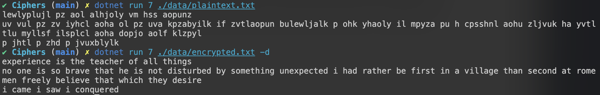

# :old_key: Caesar Cipher

## :closed_book: How to use it

Clone the repo 

---

`git clone https://github.com/lukyrasocha/learn-CSharp.git`

Change the directory

---

`cd learn-CSharp/project/Ciphers`

Build the executable file

`dotnet build`

Find the executable file in the `bin` folder

Encrypt a file

`./caesar 7 ./data/plaintext.txt`

Decrypt a file

`./caesar 7 ./data/encrypted.txt -d`

Example

